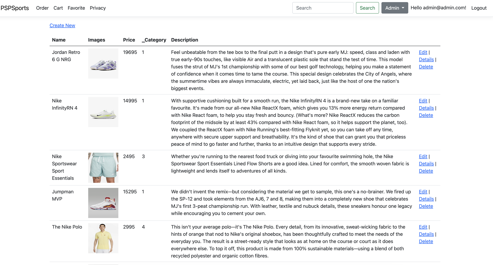

# PSPCommerce
An E-commerce site built using ASP.NET MVC for 6th sem College Project

## Technologies Used

- [ASP.NET MVC](https://dotnet.microsoft.com/en-us/apps/aspnet/mvc) A web application framework developed by Microsoft that implements the MVC pattern
- [Bootstrap](https://getbootstrap.com/) CSS framework
- [Stripe](https://stripe.com) Payment Service Provider
- [Microsoft Azure App Service](https://azure.microsoft.com/en-us/products/app-service) Fully managed platform to build and host web applications

## Features

- Authentication and Authorization with email & password
- Products List, Search Products, Orders, Category, Favorites
- Add to Cart and Payment
- Admin Panel for User, Product, Category, Orders

## Running the site

Add Database ConnectionString and Stripe API key in [appsettings.json](/PSPCommerce/appsettings.json)

```bash
# Run development server
dotnet run PSPCommerce
```

## Site Screenshots

<div style="display: grid; grid-template-columns: repeat(3, 1fr); gap: 10px;">
  
  
  
  
  
  
  
  
</div>
